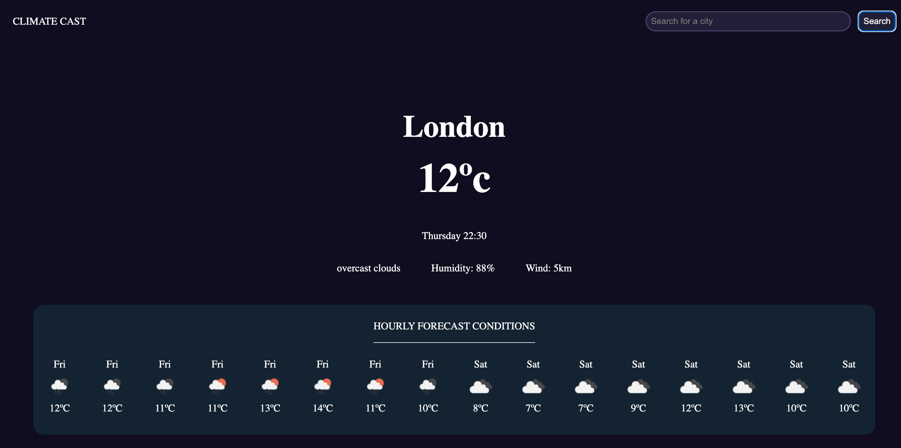

Click the link to gain access to the Employee Password Generator! https://giftyaning.github.io/Climate-Cast/

Climate Cast is a web application designed to provide users with current weather conditions and a 5-day forecast for cities around the world. With dynamically updated HTML and CSS, users can easily plan their travels and activities based on weather forecasts.

## Features

- **City Search**: Users can input the name of a city they want to check the weather for using the search form.
- **Current Weather Display**: Upon submitting a city name, the dashboard presents the current weather conditions, including temperature, humidity, and wind speed.
- **5-Day Forecast**: The dashboard also displays a 5-day forecast for the searched city, showing weather information for each day.
- **Responsive Design**: The application is designed to be responsive and works well on various devices, including desktops, tablets, and mobile phones.

## Technologies Used

- HTML: Structure of the web pages.
- CSS: Styling and layout of the dashboard.
- JavaScript: Functionality and interaction of the web application.
- Axios: Used for making HTTP requests to retrieve weather data from the OpenWeatherMap API.
